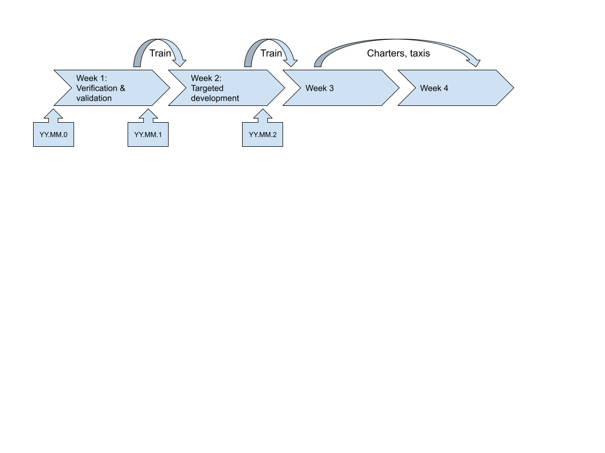



# ePIC Simulation Production Strategy
Versions:
- 1.0; [source as approved](https://docs.google.com/document/d/16PWnAVpR9qhymDkzAmmEnmzhswJy9SB0s0C7fW89-Lo/edit)

## Objectives

1. Achieve continuous deployment of the software used for detector and physics simulations. 
2. Ensure regular updates of simulation productions for detector and physics studies, as well as for geometry and algorithm development. The simulation outputs provide detailed information about the modeling of physics and background processes, the simulation of the detector and its readout, and the reconstruction of physics objects from the detector information.
3. Implement timely validation and quality control for simulation production on data sets that require significant time and resources.

## Strategy

We use three types of simulation productions:

* _Train_: a simulation production for validation and verification that is submitted on a fixed time schedule, with whichever features are available at that time. The _train_ leaves the station at a fixed time.
* _Charter_: a simulation production that is requested by the Technical and Physics Coordinators, with larger standard data sets that are already benchmarked. _Charter_ simulation productions can be run after the validation and verification, in the third and fourth week of a month only. The Production WG determines when the _charter_ starts (within a launch window).
* _Taxi_: a simulation production that is requested on a one-off basis, for individual datasets. A _taxi_ is only available when no _train_ or _charter_ is available. _Taxi_ simulation productions can be run in the third and fourth week of a month only. Due to the overhead required for a _taxi_ simulation production, no _taxi_ can be guaranteed.

## Schedule

The following cycle will be run every month (starting May 1), with a simulation production coordinator responsible for ensuring the times are adhered to.

* **On the first Monday of the month** (first working day if US federal holiday):
    * A new geometry release is tagged with version `YY.MM.0` (release branch `YY.MM`).
    * A new reconstruction release is tagged with a semver `MM.mm.pp`.
    * A new stable software environment is tagged with version `YY.MM.0` (with release branch `YY.MM`).
    * The cutoff for inclusion in these release tags should be considered to be COB of the last working day before the first Monday of the month.
* **On the Wednesday of the first working week**, a segment of the weekly software and computing meeting will be dedicated to a summary of changes, identification of missed targets, and prioritization of sprint goals.
* **The first working week of the month** is used for verification and validation. No new features are allowed to be merged into production main branches during this first week.
    * By COB on the last working day of this first week (at the latest), a standard DIS NC Pythia8 data set _train_ is submitted for simulation production. This production typically takes about 125k core-hours per detector configuration (2 days at 2000 cores). As the validation and verification process becomes more detailed, it is expected to encompass other physics processes as well. 
* **On the Wednesday of the second working week**, a segment of the weekly software and computing meeting will be dedicated to an overview of the verification and validation, and of the first _train_ data sets.
* **The second working week of the month** is used for a development sprint towards specific goals identified during the first week (essentially, what didn’t get done yet).
    * On the last working day of this second week, a new geometry and reconstruction release  is tagged (see above), and a new stable software environment.
    * By COB on the last working day of this second week (at the latest), a standard DIS NC Pythia8 data set _train_ is submitted for simulation production. This production typically takes about 125k core-hours per detector configuration (2 days at 2000 cores).
* In the **third and fourth weeks of the month**, there will be no major changes to the geometry and reconstruction (those should be deferred to the next month). This period of stability is intended for **_charter_ and _taxi_ **simulation production. 
